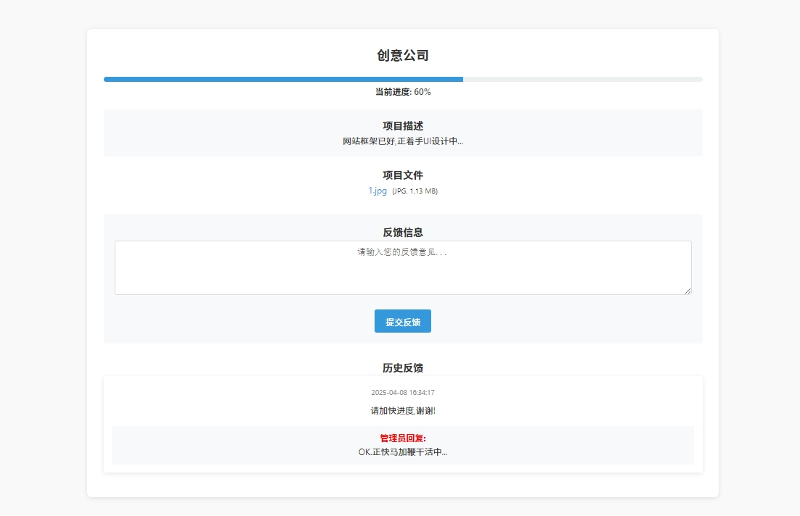

# 项目进度查询

[Project Progress Query]

项目进度查询简单系统，依赖JSON文件存储[No MySQL]，适合小团队使用低并发场景。

# 核心功能包括：

1.客户侧：通过查询码查看进度、提交反馈。

2.管理侧：管理项目生命周期（增删改查）、处理客户反馈。

3.安全设计：从输入过滤到操作验证，覆盖基本安全需求。

## 一. 项目进度查询功能（前端展示）

查询界面 (query.php)：

通过输入查询码查看项目详情（GET/POST请求均可）

显示项目名称、进度条、描述、文件列表

支持客户提交反馈意见

展示历史反馈及管理员回复

核心特性：

进度条可视化（百分比显示）

文件下载（支持多种格式：图片、PDF、Office文档等）

反馈表单的防XSS过滤（sanitize_input）

## 二. 管理员后台功能

项目管理 (admin.php, admin_action.php, admin_edit.php)：

创建项目：

设置项目名称、描述、进度百分比

多文件上传（限制文件类型和大小）

自动生成唯一查询码（generate_code）

编辑/删除项目：

修改项目信息或删除项目（连带删除关联文件）

增删项目文件

列表展示：

按创建时间排序项目

提供预览链接（跳转到查询页）

反馈管理：

查看所有客户反馈（按时间倒序）

回复客户反馈或更新回复

自动关联反馈到对应项目

安全控制：

管理员登录验证（require_admin）

CSRF防护（通过令牌验证）

文件上传校验（类型、大小）

## 三. 客户反馈功能

提交反馈 (feedback.php)：

客户通过查询页提交反馈（需关联项目ID和查询码）

数据过滤防止注入（sanitize_input）

存储反馈时间和内容

反馈展示：

在查询页显示历史反馈

区分客户留言和管理员回复（样式不同）

## 四. 系统安全与工具函数

安全措施：

密码哈希存储(admin.php) 默认密码:admin888

文件上传限制（5MB，白名单扩展名）

输入数据过滤（htmlspecialchars + strip_tags）

CSRF令牌验证（关键操作如删除、回复）

工具函数：

文件大小格式化（format_size）

唯一ID生成（uniqid）

数据存储使用JSON文件（模拟数据库）

## 五. 其他功能

文件管理：

文件上传到uploads/目录

删除项目时自动清理关联文件

响应式设计：

前端使用CSS适配不同设备（.container样式）

错误处理：

无效查询码提示

文件上传错误反馈

## 压力测试
🌐 测试网址：[点击进入](https://xugang.ct.ws/progress/)

CODE: C490D969

